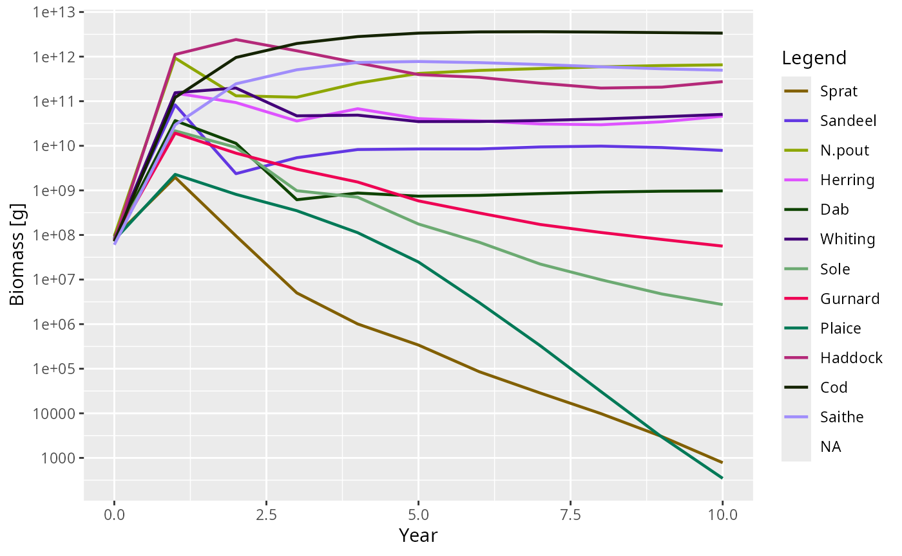
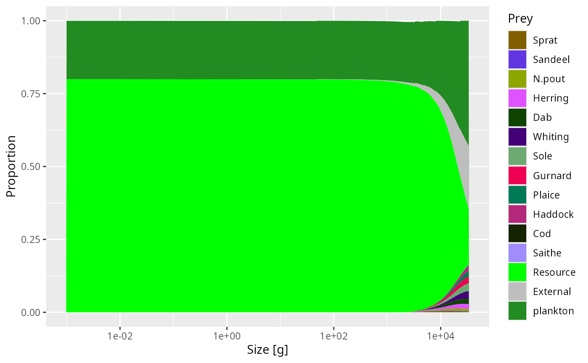

# Using and adapting the mizer extension template

## What this package is

`mizerExtensionTemplate` is a working mizer extension package that you
can clone and adapt. Every line of code is commented to explain *what*
is being done and *why*. Read the source files alongside this vignette.

For the full conceptual background see:

- [`vignette("extending-mizer", package = "mizer")`](https://sizespectrum.org/mizer/articles/extending-mizer.html)
  — all five extension mechanisms with worked examples.
- [`vignette("creating-extension-packages", package = "mizer")`](https://sizespectrum.org/mizer/articles/creating-extension-packages.html)
  — turning a script into a composable, shareable package.

## The extension at a glance

`mizerExtensionTemplate` adds three things to a standard mizer model:

| Mechanism | What it adds | Where |
|----|----|----|
| [`setExtEncounter()`](https://sizespectrum.org/mizer/reference/setExtEncounter.html) | Fixed allometric extra food | `constructor.R` |
| [`setExtMort()`](https://sizespectrum.org/mizer/reference/setExtMort.html) | Fixed background mortality | `constructor.R` |
| `projectEncounter` S3 method | Seasonal encounter multiplier | `rate-methods.R` |
| `setComponent("plankton")` | Dynamical plankton spectrum | `constructor.R` + `component-functions.R` |
| `getBiomass` S3 methods | Includes plankton in output | `generic-methods.R` |
| Bundled data object | `example_params` ready to use | `data/`, `R/data.R`, `.onLoad` |

## Bundled example model

The package ships a ready-made `example_params` object — a three-species
(Sprat, Herring, Cod) model built with
[`newExtensionTemplateParams()`](https://sizespectrum.org/mizerExtensionTemplate/reference/newExtensionTemplateParams.md).
It is stored in `data/example_params.rda` and lazy-loaded by R, but the
`.onLoad` hook replaces the plain binding with an active binding so that
every access returns an object with the correct S4 extension class:

``` r

class(example_params)   # mizerExtensionTemplate, not plain MizerParams
#> [1] "mizerExtensionTemplate"
#> attr(,"package")
#> [1] "mizerExtensionTemplate"
getBiomass(example_params)  # Plankton entry is present
#>        Sprat      Herring          Cod     Plankton 
#> 1.630305e+08 9.125316e+07 1.494402e+08 2.673020e+12
```

You can use it directly without calling
[`newExtensionTemplateParams()`](https://sizespectrum.org/mizerExtensionTemplate/reference/newExtensionTemplateParams.md):

``` r

sim <- project(example_params, t_max = 5)
plotBiomass(sim)
```

## Quick start (build your own)

``` r

params <- newExtensionTemplateParams(NS_species_params)
sim    <- project(params, t_max = 10)
plotBiomass(sim)   # Plankton column appears automatically
```

    #> Warning in plotDataFrame(plot_dat, params, xlab = "Year", ylab = y_label, :
    #> missing legend in params@linecolour, some groups won't be displayed
    #> Warning: Removed 11 rows containing missing values or values outside the scale range
    #> (`geom_line()`).



## How the seasonal encounter works

The seasonal multiplier peaks at `t = 0.25` (quarter-year) and troughs
at `t = 0.75`. With the default amplitude of 0.2 the encounter rate
varies by ±20 % around its annual mean.

``` r

params_s <- newExtensionTemplateParams(NS_species_params, season_amplitude = 0.4)
enc_t0   <- getEncounter(params_s, t = 0)    # multiplier = 1.0
enc_t025 <- getEncounter(params_s, t = 0.25) # multiplier = 1.4
range(enc_t025 / enc_t0, na.rm = TRUE)
#> [1] 1.4 1.4
```

This seasonal effect is implemented in
[`projectEncounter.mizerExtensionTemplate()`](https://sizespectrum.org/mizerExtensionTemplate/reference/projectEncounter.mizerExtensionTemplate.md)
(`rate-methods.R`). It calls
[`NextMethod()`](https://rdrr.io/r/base/UseMethod.html) to get the base
encounter rate (including the plankton contribution), then multiplies by
the seasonal factor. Using a `project*` method rather than
[`setRateFunction()`](https://sizespectrum.org/mizer/reference/setRateFunction.html)
means another extension package can also modify the encounter rate
without conflict.

## How the plankton component works

The plankton is a vector spectrum stored on the full resource size grid.
At each time step:

1.  [`planktonEncounter()`](https://sizespectrum.org/mizerExtensionTemplate/reference/planktonEncounter.md)
    adds the plankton encounter contribution to
    [`getEncounter()`](https://sizespectrum.org/mizer/reference/getEncounter.html)
    by presenting the plankton as an extra resource.
2.  [`planktonDynamics()`](https://sizespectrum.org/mizerExtensionTemplate/reference/planktonDynamics.md)
    updates the plankton by solving the ODE `dP/dt = r(K − P) − m·P`
    analytically over the time step, where `m` is the predation
    mortality on the plankton spectrum.

``` r

plotDiet(params, species = "Cod")
```



## Adapting this template for your extension

1.  **Rename the package**: search and replace `mizerExtensionTemplate`
    → your package name throughout all files, including `DESCRIPTION`,
    the R files, `NAMESPACE`, and this vignette.

2.  **Decide: metadata-only or dispatching?**

    - *Metadata-only* (like `mizerStarvation`): delete
      `mizerExtensionTemplate-class.R`, remove the `setClass()` calls,
      and remove the
      [`coerceToExtensionClass()`](https://sizespectrum.org/mizer/reference/coerceToExtensionClass.html)
      call at the end of the constructor. Keep
      `params@extensions <- getRegisteredExtensions()`.
    - *Dispatching* (like `mizerShelf`): keep everything and define S3
      methods for the generics you need to override.

3.  **Remove mechanisms you don’t need**: each of the five mechanisms in
    `constructor.R` is independent. Delete the blocks that do not apply
    to your extension.

4.  **Replace the plankton component** with your own component, or
    remove
    [`setComponent()`](https://sizespectrum.org/mizer/reference/setComponent.html)
    entirely if you don’t need a dynamical state variable.

5.  **Run
    [`devtools::document()`](https://devtools.r-lib.org/reference/document.html)**
    to regenerate `NAMESPACE` from the roxygen2 tags, then
    [`devtools::test()`](https://devtools.r-lib.org/reference/test.html)
    and
    [`devtools::check()`](https://devtools.r-lib.org/reference/check.html)
    before publishing.

## Checklist for dispatching extension authors

`setClass("<myExt>", contains = "MizerParams")` and
`setClass("<myExt>Sim", contains = "MizerSim")` in the class file.

`mizer::registerExtension(pkgname, requirement = ...)` in `.onLoad`.

Constructor ends with `params@extensions <- getRegisteredExtensions()`
and `coerceToExtensionClass(params)`.

For every `MizerParams` or `MizerSim` object bundled in `data/`, add a
`makeActiveBinding` call in `.onLoad` (see
`mizerExtensionTemplate-package.R`).

Every S3 method is registered via `@method` + `@export`.

Every S3 method calls
[`NextMethod()`](https://rdrr.io/r/base/UseMethod.html).

Rate modifications use `project*` methods, not
[`setRateFunction()`](https://sizespectrum.org/mizer/reference/setRateFunction.html).

Extension-specific state lives in `other_params(params)` or component
params — not in new S4 slots.
