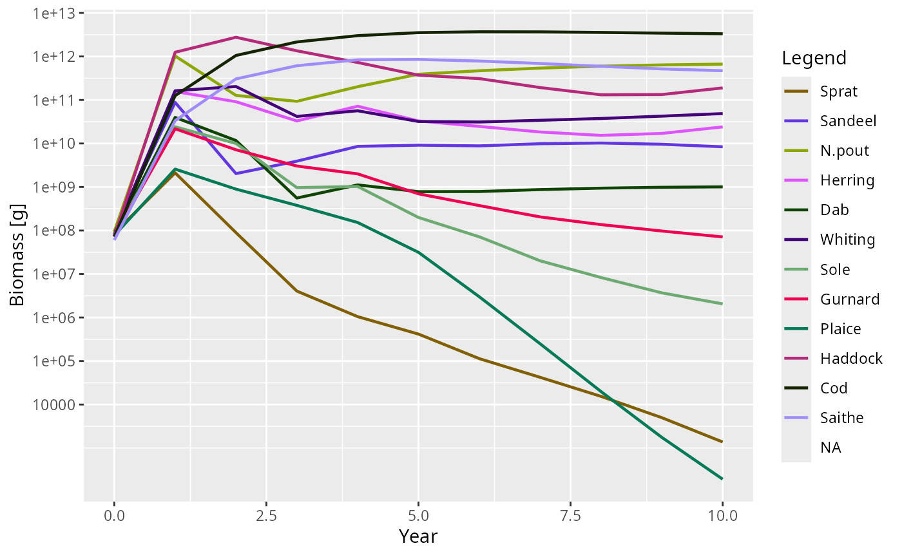
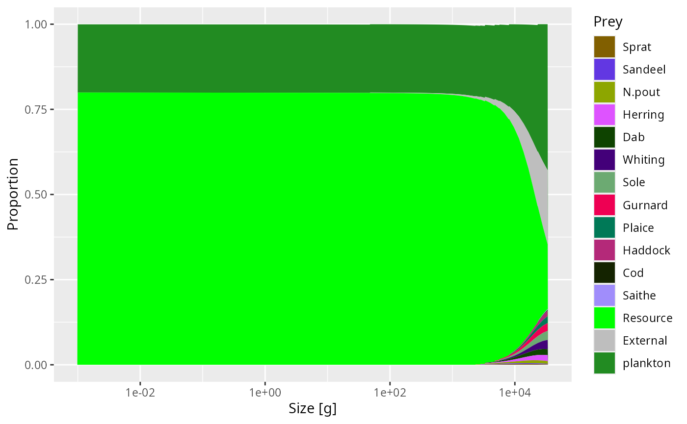
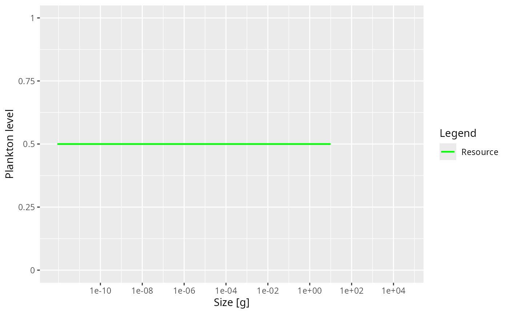

# Using and adapting the mizer extension template

## What this package is

`mizerExtensionTemplate` is a working mizer extension package that you
can clone and adapt. Every line of code is commented to explain *what*
is being done and *why*. Read the source files alongside this vignette.

For the full conceptual background see:

- [`vignette("guide-extend-mizer", package = "mizer")`](https://sizespectrum.org/mizer/articles/guide-extend-mizer.html)
  — all five extension mechanisms with worked examples.
- [`vignette("guide-create-extension-package", package = "mizer")`](https://sizespectrum.org/mizer/articles/guide-create-extension-package.html)
  — turning a script into a composable, shareable package.

## The extension at a glance

`mizerExtensionTemplate` adds three things to a standard mizer model:

| Mechanism                                                                            | What it adds                                                                                                          | Where                                     |
|--------------------------------------------------------------------------------------|-----------------------------------------------------------------------------------------------------------------------|-------------------------------------------|
| [`setExtEncounter()`](https://sizespectrum.org/mizer/reference/setExtEncounter.html) | Fixed allometric extra food                                                                                           | `constructor.R`                           |
| [`setExtMort()`](https://sizespectrum.org/mizer/reference/setExtMort.html)           | Fixed background mortality                                                                                            | `constructor.R`                           |
| `projectEncounter` S3 method                                                         | Seasonal encounter multiplier                                                                                         | `rate-methods.R`                          |
| `setComponent("plankton")`                                                           | Dynamical plankton spectrum                                                                                           | `constructor.R` + `component-functions.R` |
| `getBiomass` S3 methods                                                              | Includes plankton in output                                                                                           | `generic-methods.R`                       |
| Classed arrays with a `type`                                                         | [`planktonLevel()`](https://sizespectrum.org/mizerExtensionTemplate/reference/planktonLevel.md) plots as a proportion | `component-functions.R`                   |
| [`signal_info()`](https://sizespectrum.org/mizer/reference/signal_info.html)         | Reports a choice, obeying `info_level`                                                                                | `constructor.R`                           |
| Bundled data object                                                                  | `example_params` ready to use                                                                                         | `data/`, `R/data.R`                       |

## Bundled example model

The package ships a ready-made `example_params` object — a three-species
(Sprat, Herring, Cod) model built with
[`newExtensionTemplateParams()`](https://sizespectrum.org/mizerExtensionTemplate/reference/newExtensionTemplateParams.md).
It is stored in `data/example_params.rda` and lazy-loaded by R. Standard
R serialisation preserves its complete S3 class vector and extension
metadata, so no `.onLoad` hook or active binding is needed:

``` r
class(example_params)   # mizerExtensionTemplate, not plain MizerParams
#> [1] "mizerExtensionTemplate" "MizerParams"
getBiomass(example_params)  # Plankton entry is present
#>        Sprat      Herring          Cod     Plankton 
#> 1.630305e+08 9.125316e+07 1.494402e+08 2.673020e+12
```

You can use it directly without calling
[`newExtensionTemplateParams()`](https://sizespectrum.org/mizerExtensionTemplate/reference/newExtensionTemplateParams.md):

``` r
sim <- project(example_params, t_max = 5)
plotBiomass(sim)
```

## Quick start (build your own)

``` r
params <- newExtensionTemplateParams(NS_species_params)
sim    <- project(params, t_max = 10)
plotBiomass(sim)   # Plankton column appears automatically
```

    #> Warning in plotDataFrame(plot_dat, params, xlab = "Year", ylab = y_label, :
    #> missing legend in params@linecolour, some groups won't be displayed
    #> Warning: Removed 11 rows containing missing values or values outside the scale range
    #> (`geom_line()`).



## How the seasonal encounter works

The seasonal multiplier peaks at `t = 0.25` (quarter-year) and troughs
at `t = 0.75`. With the default amplitude of 0.2 the encounter rate
varies by ±20 % around its annual mean.

``` r
params_s <- newExtensionTemplateParams(NS_species_params, season_amplitude = 0.4)
enc_t0   <- getEncounter(params_s, t = 0)    # multiplier = 1.0
enc_t025 <- getEncounter(params_s, t = 0.25) # multiplier = 1.4
range(enc_t025 / enc_t0, na.rm = TRUE)
#> [1] 1.4 1.4
```

This seasonal effect is implemented in
[`projectEncounter.mizerExtensionTemplate()`](https://sizespectrum.org/mizerExtensionTemplate/reference/projectEncounter.mizerExtensionTemplate.md)
(`rate-methods.R`). It calls
[`NextMethod()`](https://rdrr.io/r/base/UseMethod.html) to get the base
encounter rate (including the plankton contribution), then multiplies by
the seasonal factor. Using a `project*` method rather than
[`setRateFunction()`](https://sizespectrum.org/mizer/reference/setRateFunction.html)
means another extension package can also modify the encounter rate
without conflict.

## How the plankton component works

The plankton is a vector spectrum stored on the full resource size grid.
At each time step:

1.  [`planktonEncounter()`](https://sizespectrum.org/mizerExtensionTemplate/reference/planktonEncounter.md)
    adds the plankton encounter contribution to
    [`getEncounter()`](https://sizespectrum.org/mizer/reference/getEncounter.html)
    by presenting the plankton as an extra resource.
2.  [`planktonDynamics()`](https://sizespectrum.org/mizerExtensionTemplate/reference/planktonDynamics.md)
    updates the plankton by solving the ODE `dP/dt = r(K − P) − m·P`
    analytically over the time step, where `m` is the predation
    mortality on the plankton spectrum.

``` r
plotDiet(params, species = "Cod")
```



## Returning arrays that plot themselves properly

When your extension returns a size- or time-resolved quantity, wrap it
in one of mizer’s array classes and say what kind of quantity the values
are, with the `type` argument. There are three types: `"value"` for a
rate or an amount, `"density"` for an amount per gram of body weight,
and `"proportion"` for a fraction.

`type` is not decoration — it decides how the array is plotted. A
`"density"` gets multiplied by the `dw/dl` Jacobian when it is plotted
against a length axis, because a density per gram is not a density per
centimetre. A `"proportion"` gets a linear y axis showing the whole of
the interval from 0 to 1, so the value can be read against the scale it
belongs to.

[`planktonLevel()`](https://sizespectrum.org/mizerExtensionTemplate/reference/planktonLevel.md)
(`component-functions.R`) is the template’s example. It returns the
plankton abundance as a fraction of its carrying capacity, mirroring
mizer’s own
[`resource_level()`](https://sizespectrum.org/mizer/reference/setResource.html):

``` r
lev <- planktonLevel(params)
attr(lev, "type")
#> [1] "proportion"
```

Because it declares itself a proportion, plotting it needs no further
instruction — the y axis runs from 0 to 1 rather than being fitted to
the data:

``` r
plot(planktonLevel(params))
#> Warning: Removed 47 rows containing missing values or values outside the scale range
#> (`geom_line()`).
```



Declare `type` for every array you return, including when it is the
default `"value"` — as
[`getBiomass.mizerExtensionTemplateSim()`](https://sizespectrum.org/mizerExtensionTemplate/reference/getBiomass.mizerExtensionTemplateSim.md)
does. If you omit it, mizer falls back to guessing from `value_name` and
`units`, which is there for backwards compatibility and is easy to fall
foul of.

## Telling the user what your extension decided

When your extension makes a choice on the user’s behalf, report it
through mizer’s own mechanism rather than with
[`message()`](https://rdrr.io/r/base/message.html) or
[`warning()`](https://rdrr.io/r/base/warning.html). A plain
[`message()`](https://rdrr.io/r/base/message.html) ignores `info_level`,
is not collected with the other reports, and is swallowed on the
`species_params<-()` path.

The constructor takes an `info_level` argument, forwards it to
[`newMultispeciesParams()`](https://sizespectrum.org/mizer/reference/newMultispeciesParams.html),
wraps its body in
[`with_info_level()`](https://sizespectrum.org/mizer/reference/with_info_level.html)
and raises one report of its own with
[`signal_info()`](https://sizespectrum.org/mizer/reference/signal_info.html).
The result is that the template’s report arrives in the same block as
mizer’s, and obeys the same switch. This template defaults to
`info_level = 0` to keep its examples quiet, so ask for the reports:

``` r
params_loud <- newExtensionTemplateParams(NS_species_params, info_level = 3)
#> ℹ No `a` column so using a = 0.01 in w = a l^b, with w in g and l in cm.
#> ℹ No `b` column so using the isometric default b = 3 in w = a l^b.
#> ℹ No h provided for some species, so using age at maturity to calculate it.
#> ℹ Because you have n != p, the default value for `h` is not very good.
#> ℹ Because the age at maturity is not known, I need to fall back to using
#> von Bertalanffy parameters, where available.
#> ℹ Using z0 = z0pre * w_inf ^ z0exp for calculated z0 values.
#> ℹ Using f0, h, lambda, kappa and the predation kernel to calculate gamma.
#> ℹ Setting the plankton capacity to half the resource capacity.
```

The last line is the template’s own. `level` decides how much it takes
to silence a report: ours is level 3, chatter that only the default
shows, so `info_level = 1` keeps mizer’s important reports and drops
ours.

``` r
params_terse <- newExtensionTemplateParams(NS_species_params, info_level = 1)
#> Because you have n != p, the default value for `h` is not very good.
```

In your own constructor, default the argument to
[`default_info_level()`](https://sizespectrum.org/mizer/reference/default_info_level.html)
instead, so it follows the `mizer_info_level` option as mizer’s own
constructors do. Take the argument explicitly either way: hard-coding
`info_level` in the call to
[`newMultispeciesParams()`](https://sizespectrum.org/mizer/reference/newMultispeciesParams.html)
makes a user who passes their own collide with it.

## Adapting this template for your extension

1.  **Rename the package**: search and replace `mizerExtensionTemplate`
    → your package name throughout all files, including `DESCRIPTION`,
    the R files, `NAMESPACE`, and this vignette.

2.  **Decide: metadata-only or dispatching?**

    - *Metadata-only* (like `mizerStarvation`): delete
      `mizerExtensionTemplate-class.R` and remove the
      [`coerceToExtensionClass()`](https://sizespectrum.org/mizer/reference/coerceToExtensionClass.html)
      call at the end of the constructor. Keep the
      [`recordExtension()`](https://sizespectrum.org/mizer/reference/recordExtension.html)
      call.
    - *Dispatching* (like `mizerShelf`): keep everything and define S3
      methods for the generics you need to override.

3.  **Remove mechanisms you don’t need**: each of the five mechanisms in
    `constructor.R` is independent. Delete the blocks that do not apply
    to your extension.

4.  **Replace the plankton component** with your own component, or
    remove
    [`setComponent()`](https://sizespectrum.org/mizer/reference/setComponent.html)
    entirely if you don’t need a dynamical state variable.

5.  **Run
    [`devtools::document()`](https://devtools.r-lib.org/reference/document.html)**
    to regenerate `NAMESPACE` from the roxygen2 tags, then
    [`devtools::test()`](https://devtools.r-lib.org/reference/test.html)
    and
    [`devtools::check()`](https://devtools.r-lib.org/reference/check.html)
    before publishing.

## Checklist for dispatching extension authors

- **No** `setClass()` or class declaration: the extension names are
  entries in ordinary S3 class vectors managed by
  [`coerceToExtensionClass()`](https://sizespectrum.org/mizer/reference/coerceToExtensionClass.html).
- Constructor ends with
  [`recordExtension()`](https://sizespectrum.org/mizer/reference/recordExtension.html)
  (including the package version and installation requirement) and
  `coerceToExtensionClass(params)`.
- Every bundled `MizerParams` or `MizerSim` object is created through
  the extension’s setup function before it is saved in `data/`.
- Every S3 method is registered via `@method` + `@export`.
- Every S3 method calls
  [`NextMethod()`](https://rdrr.io/r/base/UseMethod.html).
- Rate modifications use `project*` methods, not
  [`setRateFunction()`](https://sizespectrum.org/mizer/reference/setRateFunction.html).
- Extension-specific state lives in `other_params(params)` or component
  params — not in new top-level list elements.
- Every array returned to the user is wrapped in a mizer array class
  with an explicit `type` (`"value"`, `"density"` or `"proportion"`).
- Anything you tell the user goes through
  [`signal_info()`](https://sizespectrum.org/mizer/reference/signal_info.html)
  inside a
  [`with_info_level()`](https://sizespectrum.org/mizer/reference/with_info_level.html),
  never a bare [`message()`](https://rdrr.io/r/base/message.html) or
  [`warning()`](https://rdrr.io/r/base/warning.html); entry points take
  `info_level = default_info_level()` and forward it.
